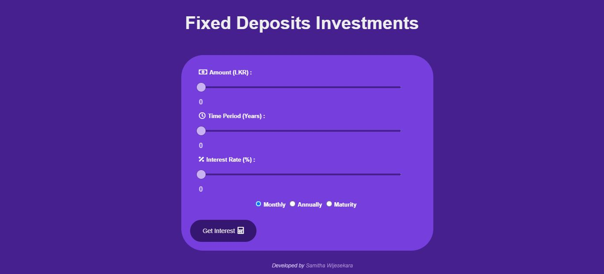
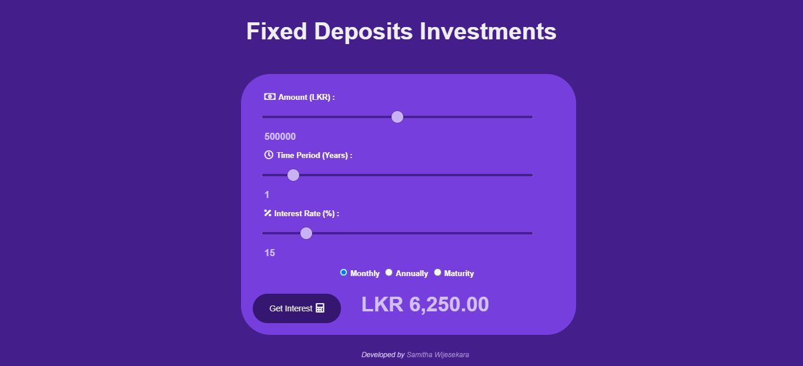

# Fixed-Deposits-Investments
See how much can you earn with fixed deposits

### Table of Content
-01 [What is this?](#What) 
-02 [For why?](#why) 
-03 [What are the technologies used?](#technologies) 
-04 [How to used this?](#How)

## What is this?<a name="What"/>
This is a simple web application for calculate Fixed Deposits interest. 

## For why?<a name="why"/>
This application could be used to calculate interest earned for Fixed Deposits.
## What are the technologies used?<a name="technologies"/>
- HTML
- CSS
- JavaScript

## How to use this?<a name="How"/>
First of all, you can set the values to deposit **Amount(LKR), Time Period(Years), and Interest Rate(%)**. After that, you can select interest paid **Monthly/Annually/Maturity** by your preference. Finally, click the **button** & then you can get the **total value of interest**.  

